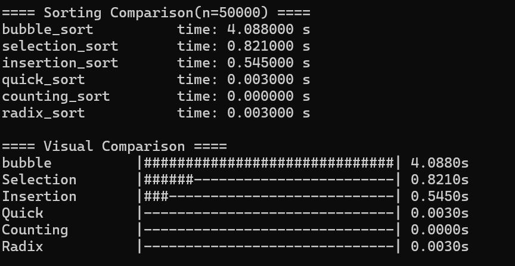

# sorting-benchmark-c
A C project comparing 6 sorting algorithms with runtime benchmarking and analysis

# Sorting Algorithms Comparison in C

-A self-study project comparing 6 sorting algorithms by runtime performance, implemented in C.  

-****Author:**:** alphabet6135  |  ****Started:**** April 2026

## Version History

| Version | Description                    | Status      |
|---------|-------------------------------|-------------|
| v1.0    | Performance benchmark (6 sorts)| Current  |
| v2.0    | Stability test                 | Planned  |
| v3.0    | Interactive menu               |  Planned  |

## Overview 

This project implements several sorting algorithms:
-Bubble Sort
-Selection Sort
-Insertion Sort
-Quick Sort
-Counting Sort
-Radix Sort

The program generates random integers, copies the same input array for each algorithm, and compares their runtime performance.

## Implementation Notes

-All sorting functions use a consistent interface: `void sort(int *arr,int n)`.
-A function pointer wrapper `time_sort` is used to measure runtime for each algorithm.
-Quick Sort is implemented with a recursive helper function and a separate `partition()` function.
-Radix Sort uses `r_counting` as a helper function for digit-based sorting.
-The program uses the same randomly generated data for all algorithms by copying the original array with `memcpy`.

| Algorithm      | Best     | Average  | Worst  | Space  | Stable |
|---------------|----------|----------|--------|--------|--------|
| Bubble Sort   | O(n)     | O(n²)    | O(n²)  | O(1)   | yes    |
| Selection Sort| O(n²)    | O(n²)    | O(n²)  | O(1)   | no     |
| Insertion Sort| O(n)     | O(n²)    | O(n²)  | O(1)   | yes     |
| Quick Sort    | O(nlogn) | O(nlogn) | O(n²)  | O(logn)| no     |
| Counting Sort | O(n+k)   | O(n+k)   | O(n+k) | O(k)   | yes     |
| Radix Sort    | O(d×n)   | O(d×n)   | O(d×n) | O(n)   | no     |

## How to Run

### Option 1: Visual Studio (Windows)

1. Open `main.c` in Visual Studio
2. Press `F5` to build and run

### Option 2: GCC (Linux/Mac)

```bash
gcc main.c -o benchmark
./benchmark
```

- Developed and tested on Windows 11 with MSVC

## Benchmark Results

- **Test environment:** Windows 11, MSVC  
- **Array size:** n = 50,000  
- **Value range:** [0, 9999]  
- **Data type:** Random integers

| Algorithm      | Time (s) | vs Bubble       | Complexity |
|---------------|----------|-----------------|------------|
| Bubble Sort   | 4.0880   | baseline (1x)   | O(n²)      |
| Selection Sort| 0.8210   | 4.9x faster     | O(n²)      |
| Insertion Sort| 0.5450   | 7.4x faster     | O(n²)      |
| Quick Sort    | 0.0030   | 1,270x faster   | O(nlogn)   |
| Counting Sort | 0.0001   | 3,809x faster   | O(n+k)     |
| Radix Sort    | 0.0030   | 1,270x faster   | O(d×n)     |

### Visual Comparison

  

## Key Observations

1. O(n²) algorithms are significantly slower at n=50,000
2. Counting Sort outperforms Quick Sort for bounded integers
3. The early-exit optimization makes Bubble Sort O(n)  
   on already-sorted arrays
4. Algorithms with the same complexity can have  
   different real-world performance

## My Thoughts

When I started this project, I expected Quick Sort to  
always be the fastest. But Counting Sort was actually  
faster for integers with a limited range.

This showed me that Big-O notation describes the trend,  
but real performance also depends on data type and range.

Next: I want to test **stability** by tracking the original  
position of equal elements, to show why stable sorting  
matters in real applications.

## What I Learned

- Runtime is affected by both time complexity and  
  implementation details
- Using identical input data is essential for fair comparison
- Function pointers allow flexible, reusable benchmark code
- `memcpy` is useful for duplicating test data efficiently
- Non-comparison sorts (Counting, Radix) can beat  
  O(nlogn) sorts under the right conditions

## Source Code

Full source code: [Sorting-Version-1.c](Sorting_c_2026/Sorting-Version-1.c)

## Blog Post

Read the full write-up on this project:  

[Why O(n²) Algorithms Don’t Run the Same (Dev.to)](https://dev.to/alphabet6135/why-on2-algorithms-dont-run-the-same-a-practical-sorting-benchmark-in-c-kce)

## License

MIT License

## Planned Updates

- **v2.0** — Stability test using tagged elements  
  `{3a, 1, 3b, 2}` to verify stable vs unstable sorts
- **v3.0** — Interactive menu for custom input  
  and algorithm selection
